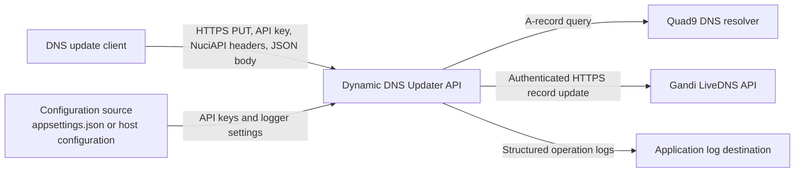
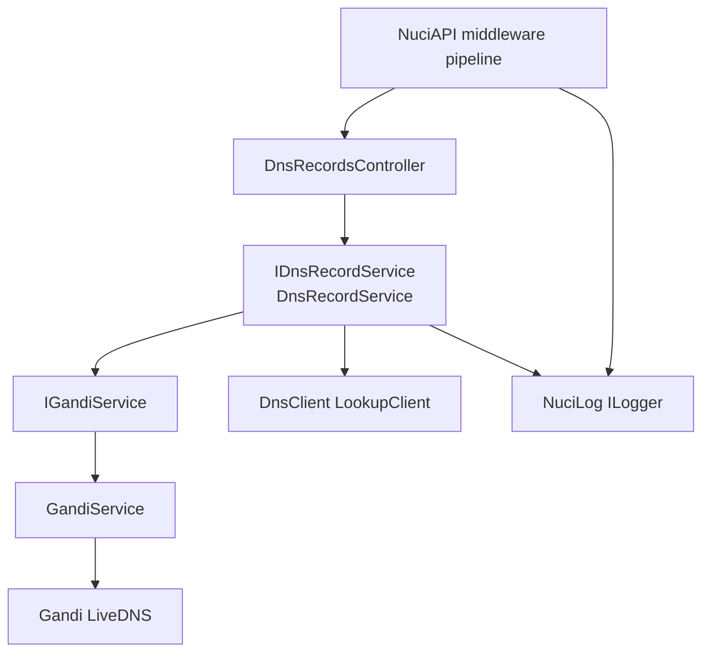
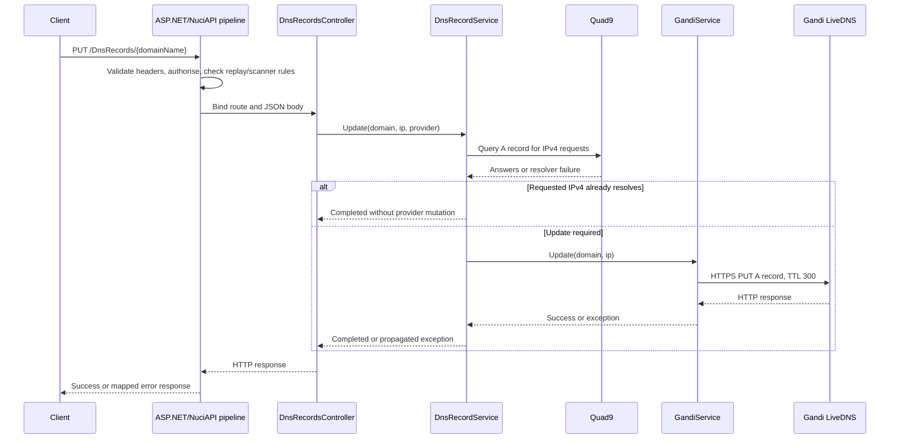
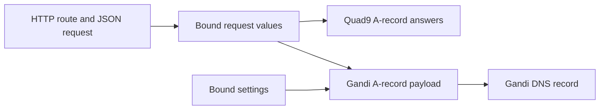
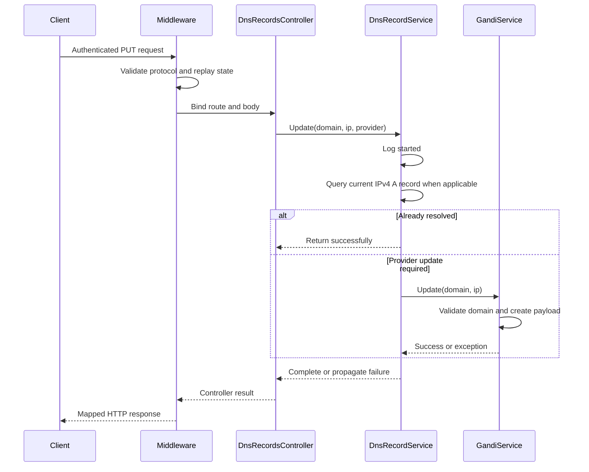
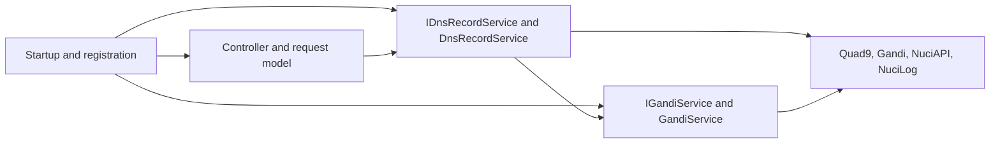

# Dynamic DNS Updater API Architecture

This document describes the current architecture of the Dynamic DNS Updater API: a single ASP.NET Core HTTP service that authorises DNS-record update requests, optionally verifies current A-record resolution, and delegates supported updates to DNS-provider integrations.

## 📑 Table of Contents

- [Table of Contents](#-table-of-contents)
- [Purpose](#-purpose)
- [System Context](#-system-context)
- [Architectural Style](#-architectural-style)
- [Runtime Flow](#-runtime-flow)
- [Components](#-components)
- [Architectural Areas](#-architectural-areas)
    - [Hosting And Composition](#hosting-and-composition)
    - [HTTP Transport](#http-transport)
    - [Application Service](#application-service)
    - [Provider Integration](#provider-integration)
    - [Verification](#verification)
- [Data Architecture](#-data-architecture)
- [Interfaces and Integrations](#-interfaces-and-integrations)
- [Key Flows](#-key-flows)
  - [Update A DNS Record](#update-a-dns-record)
- [DNS Resolution Short-Circuit](#-dns-resolution-short-circuit)
- [Cross-Cutting Concerns](#-cross-cutting-concerns)
  - [Security and Privacy](#security-and-privacy)
  - [Error Handling](#error-handling)
  - [Observability](#observability)
  - [Configuration](#configuration)
  - [Concurrency and Resource Use](#concurrency-and-resource-use)
- [Dependency Direction and Rules](#-dependency-direction-and-rules)
- [External Dependencies](#-external-dependencies)
- [Deployment and Operations](#-deployment-and-operations)
- [Compatibility Contracts](#-compatibility-contracts)
- [Testing and Verification](#-testing-and-verification)
- [Design Constraints](#-design-constraints)
- [Extension Points](#-extension-points)
  - [DNS Provider Integration](#dns-provider-integration)
- [Source Map](#-source-map)
- [Related Documentation](#-related-documentation)

## 🎯 Purpose

The API updates an authoritative DNS record through a configured provider when an authenticated client supplies a domain name, IP address, and provider name. This document records the current process boundary, request and integration contracts, ownership rules, security controls, and verification boundaries for maintainers and contributors.

The system boundary is the running ASP.NET Core process and its application code. Provider APIs, public DNS resolvers, callers, configuration sources, and deployment infrastructure remain external boundaries.

## 🌐 System Context

Clients send an authenticated `PUT /DnsRecords/{domainName}` request to the API. The service validates NuciAPI protocol headers and replay state, checks API-key authorisation, binds the JSON body, and delegates the update. The application queries Quad9 for an existing A record and calls Gandi LiveDNS when an update is required. No application-owned database or durable state store is present in the repository.



The principal external boundaries are:
- **API clients:** Own the request identifier, client identifier, timestamp, authorisation value, domain route value, and JSON update payload sent to the service.
- **Configuration source:** Supplies `SecuritySettings`, `GandiSettings`, and NuciLog settings; the host environment owns the secure provision of API keys.
- **Quad9 DNS resolver:** Supplies current public A-record answers for the no-update optimisation; the application treats resolver failures as non-fatal and proceeds towards provider evaluation.
- **Gandi LiveDNS API:** Owns the remote DNS record mutation; the Gandi adapter supplies an A-record payload with TTL 300 and translates unsuccessful responses into exceptions.
- **Log destination:** Receives operation status and contextual values through NuciLog; deployment configuration controls whether file output is enabled.

## 🏗️ Architectural Style

The repository implements a modular monolith hosted as one ASP.NET Core process. Its HTTP transport is middleware-driven, its application orchestration is service-oriented, and its provider boundary is represented by interfaces with an adapter for Gandi. Dependency injection composes the modules at startup.

The consequence is a compact deployment and a clear provider substitution boundary, while the current implementation remains coupled to one supported provider and to NuciAPI middleware contracts.



The principal architecture boundaries are:
- **HTTP and middleware boundary:** Owns protocol validation, authorisation, replay protection, scanner protection, exception translation, request logging, routing, and response production.
- **Controller boundary:** Owns route and JSON binding, then forwards values to `IDnsRecordService`; it does not select providers or call remote APIs directly.
- **Application service boundary:** Owns DNS-resolution short-circuiting, provider-name interpretation, update orchestration, and operation logging.
- **Provider integration boundary:** Owns provider-specific domain parsing, request construction, authentication headers, HTTP transport, and remote response interpretation.
- **Configuration boundary:** Owns binding of external configuration into singleton settings objects consumed by application and integration services.

## 🔄 Runtime Flow



The principal runtime sequence is:
1. The host creates the ASP.NET Core application, binds configuration, registers controllers, services, settings, logger, and NuciAPI middleware, then starts listening on configured ASP.NET Core URLs.
2. The middleware pipeline processes an HTTP request, including exception handling, scanner protection, request logging, HTTPS redirection, routing, header validation, replay protection, and authorisation-related processing.
3. `DnsRecordsController` receives the route domain and `PutDnsRecordRequest` body and invokes `IDnsRecordService.Update`.
4. `DnsRecordService` logs the operation, queries Quad9 for eligible IPv4 requests, and returns early when the requested address is already present.
5. For an update, the service resolves the provider name and invokes the supported provider adapter. Gandi constructs and sends the remote A-record update.
6. Success or an exception returns through the middleware pipeline, where NuciAPI exception handling maps recognised failures to API responses.

## 🧩 Components

| Component | Responsibility | Principal Dependencies | Lifetime or Ownership |
|-----------|----------------|------------------------|-----------------------|
| ASP.NET Core host | Creates and runs the web process and invokes `Startup` | .NET hosting APIs | Process lifetime; owned by the host |
| `Startup` | Registers services and orders the middleware pipeline | ASP.NET Core, NuciAPI middleware, extension methods | Application composition root |
| `DnsRecordsController` | Binds `PUT /DnsRecords/{domainName}` and forwards update values | `IDnsRecordService`, `SecuritySettings`, NuciAPI controller base | Controller-managed request lifetime |
| `DnsRecordService` | Coordinates logging, DNS lookup, provider selection, and update invocation | `IGandiService`, NuciLog, DnsClient | Transient |
| `GandiService` | Validates Gandi domain shape, creates the A-record payload, and calls Gandi | `GandiSettings`, `HttpClient`, NuciExtensions | Transient; creates an HTTP client per update |
| `SecuritySettings` and `GandiSettings` | Hold bound API-key configuration | `IConfiguration` | Singleton settings instances |
| NuciAPI middleware | Implements request validation, replay/scanner protection, logging, authorisation support, and exception mapping | NuciAPI middleware packages | Pipeline lifetime; middleware owns its state and behaviour |
| NuciLog logger | Emits operation status and context | NuciLog packages and configured logger settings | Transient logger registration; output configured by host |

## 🗂️ Architectural Areas

### Hosting And Composition

Paths:
- [Program.cs](DynamicDnsUpdater.API/Program.cs)
- [Startup.cs](DynamicDnsUpdater.API/Startup.cs)
- [ServiceCollectionExtensions.cs](DynamicDnsUpdater.API/ServiceCollectionExtensions.cs)

Responsibilities:
- Create the ASP.NET Core host and configure web defaults.
- Register configuration objects, application services, provider services, controllers, and middleware.
- Define middleware ordering and endpoint mapping.

Boundary rules:
- Composition code may reference concrete implementations and third-party middleware to assemble the process.
- Runtime services are consumed through interfaces where the application boundary defines them.

### HTTP Transport

Paths:
- [DnsRecordsController.cs](DynamicDnsUpdater.API/Controllers/DnsRecordsController.cs)
- [PutDnsRecordRequest.cs](DynamicDnsUpdater.API/Requests/PutDnsRecordRequest.cs)

Responsibilities:
- Expose the DNS update route and JSON request shape.
- Forward decoded route and body values to the application service.

Boundary rules:
- Controllers must not contain provider-specific HTTP calls or DNS resolution logic.
- Request values remain transport data until the application service interprets them.

### Application Service

Paths:
- [IDnsRecordService.cs](DynamicDnsUpdater.API/Service/IDnsRecordService.cs)
- [DnsRecordService.cs](DynamicDnsUpdater.API/Service/DnsRecordService.cs)
- [DnsProvider.cs](DynamicDnsUpdater.API/Service/Models/DnsProvider.cs)

Responsibilities:
- Orchestrate the update use case.
- Apply the current-resolution optimisation and select a supported provider.
- Record operation status and rethrow failures after logging them.

Boundary rules:
- Provider selection is based on the `DnsProvider` model and must not be duplicated in controllers.
- The service depends on provider contracts rather than constructing provider-specific orchestration elsewhere.

### Provider Integration

Paths:
- [IGandiService.cs](DynamicDnsUpdater.API/Service/Integrations/Gandi/IGandiService.cs)
- [GandiService.cs](DynamicDnsUpdater.API/Service/Integrations/Gandi/GandiService.cs)
- [GandiSettings.cs](DynamicDnsUpdater.API/Configuration/GandiSettings.cs)

Responsibilities:
- Translate the application update into the Gandi LiveDNS HTTP contract.
- Validate provider-specific domain requirements and interpret remote responses.

Boundary rules:
- Provider-specific URL, authentication header, JSON payload, and remote error parsing remain inside the adapter.
- New providers must not require controller changes beyond the provider-selection and registration contracts.

### Verification

Paths:
- [DynamicDnsUpdater.API.UnitTests](DynamicDnsUpdater.API.UnitTests)
- [DynamicDnsUpdater.API.IntegrationTests](DynamicDnsUpdater.API.IntegrationTests)

Responsibilities:
- Verify service/provider behaviour in isolation.
- Verify middleware, routing, binding, replay protection, security, and exception responses through an in-memory host.

Boundary rules:
- Integration tests replace the application service and logger with test doubles when testing transport and middleware behaviour.
- Tests do not represent a live Gandi or Quad9 environment unless explicitly configured outside the repository.

## 💾 Data Architecture

The application has no repository-owned database or durable domain store. Its principal data is request data, configuration, transient DNS answers, and remote-provider payloads. Replay and scanner protection are supplied by NuciAPI middleware; the repository does not define their internal storage or retention implementation.



| Data or Store | Owner | Representation and Storage | Lifecycle or Consistency |
|---------------|-------|----------------------------|--------------------------|
| DNS update request | ASP.NET Core model binding and controller | Route value plus JSON `ip` and `provider` properties in process memory | Request lifetime; forwarded to the application service |
| `SecuritySettings` | Composition root | Configuration-bound singleton containing the API key | Process lifetime; supplied by host configuration |
| `GandiSettings` | Composition root and Gandi adapter | Configuration-bound singleton containing the provider API key | Process lifetime; supplied by host configuration |
| Quad9 DNS answers | `DnsRecordService` and DnsClient | No-cache `LookupClient` query result in process memory | Per lookup; resolver failures do not persist and cause the update path to continue |
| Gandi DNS record | Gandi LiveDNS | Remote authoritative provider state updated through HTTPS | Owned by Gandi; the API requests an A record with TTL 300 and does not persist a local copy |
| Replay/scanner state | NuciAPI middleware | Middleware-managed state; internal representation is outside this repository | Managed by the dependency; exact retention and storage are not defined in repository code |

## 🔌 Interfaces and Integrations

| Interface or Integration | Direction | Contract | Owner | Failure Semantics |
|--------------------------|-----------|----------|-------|-------------------|
| DNS update HTTP endpoint | Inbound | `PUT /DnsRecords/{domainName}` with JSON `{ "ip": "...", "provider": "..." }` and NuciAPI headers | `DnsRecordsController` and middleware | Middleware or controller pipeline returns mapped HTTP responses; service exceptions are translated by NuciAPI exception handling |
| `IDnsRecordService` | In-process inbound | `Update(string domainName, string ipAddress, string dnsProviderName)` | Application service | Exceptions propagate to the middleware boundary |
| `IGandiService` | In-process outbound | `Update(string domainName, string ipAddress)` | Gandi adapter | Provider validation and HTTP failures are raised as exceptions |
| Quad9 DNS service | Outbound | DNS A-record query to `9.9.9.9` or `149.112.112.112` | `DnsRecordService` | DNS response and socket failures are treated as no optimisation match, so the update path continues |
| Gandi LiveDNS | Outbound | HTTPS `PUT` to the v5 LiveDNS record endpoint with API-key header and JSON A-record payload | `GandiService` | Non-success responses are parsed where possible and raised as `HttpRequestException`; no retry or fallback is implemented |

## 🔀 Key Flows

### Update A DNS Record



The controller owns transport binding, the application service owns orchestration, and the provider adapter owns Gandi-specific protocol details. The service logs failure and rethrows it, preserving middleware ownership of error-response translation. The current implementation supports only the `Gandi` provider; an unknown provider is not a graceful fallback path.

## ⚙️ DNS Resolution Short-Circuit

For an IPv4 request, `DnsRecordService` queries Quad9 for the domain's A records with caching disabled. If an answer equals the requested address, the service logs success and does not call the provider. IPv6 requests and unparsable addresses bypass this optimisation and proceed to provider selection. DNS response and socket failures also bypass the optimisation rather than failing the update operation.

This reduces unnecessary provider writes but does not provide a transaction or guarantee that the remote authoritative record remains unchanged after the lookup.

## 🧵 Cross-Cutting Concerns

### Security and Privacy

The request crosses an external client-to-service trust boundary. NuciAPI middleware validates client identifier, request identifier, timestamp, replay, scanner, and authorisation concerns before the controller is invoked. The controller constructs API-key authorisation from `SecuritySettings` and passes it to the NuciAPI controller processing method.

API keys are bound from configuration and must be supplied by the deployment environment rather than committed as real values. The Gandi API key is added to the outbound provider request as an `Authorization` header. Logs include provider, domain, and requested IP context; deployments should therefore restrict log access and must not place secrets in those fields.

The repository verifies security and replay behaviour through [RequestSecurityApiTests.cs](DynamicDnsUpdater.API.IntegrationTests/RequestSecurityApiTests.cs) and [ReplayProtectionApiTests.cs](DynamicDnsUpdater.API.IntegrationTests/ReplayProtectionApiTests.cs).

### Error Handling

NuciAPI exception handling is registered first in the application pipeline and maps recognised exceptions to response codes. Integration tests verify mappings for bad requests, authentication failures, unavailable dependencies, conflicts, not-found responses, not-implemented providers, client cancellation, and unclassified failures in [ExceptionHandlingApiTests.cs](DynamicDnsUpdater.API.IntegrationTests/ExceptionHandlingApiTests.cs).

`DnsRecordService` records provider failures as failed operations and rethrows them. `GandiService` raises format, argument, JSON parsing, and HTTP exceptions; it does not implement retry, circuit breaking, or fallback. DNS lookup failures are the deliberate exception: they are treated as an optimisation miss and do not prevent provider evaluation.

### Observability

The application emits NuciLog operation records for DNS updates with operation, status, provider, domain, and IP context. The logger destination and file-output flag are configured through `nuciLoggerSettings`. The repository does not define metrics, distributed tracing, health checks, or an audit store.

### Configuration

| Configuration Area | Source | Responsibility | Override or Secret Policy |
|--------------------|--------|----------------|---------------------------|
| `securitySettings` | ASP.NET Core configuration, represented by [appsettings.json](DynamicDnsUpdater.API/appsettings.json) | Supplies the API key used by the controller authorisation object | Must be provided as a deployment secret or secure configuration value; the example contains a token placeholder |
| `gandiSettings` | ASP.NET Core configuration, represented by [appsettings.json](DynamicDnsUpdater.API/appsettings.json) | Supplies the Gandi LiveDNS API key | Must be provided as a deployment secret or secure configuration value; the example contains a token placeholder |
| `nuciLoggerSettings` | ASP.NET Core configuration | Controls log file path and file output | Host configuration can provide environment-specific values; integration tests override these values in memory |

`ServiceCollectionExtensions.AddConfigurations` binds these sections once and registers the resulting settings as singletons. The repository does not define a separate environment-variable or command-line precedence contract beyond standard ASP.NET Core configuration behaviour.

### Concurrency and Resource Use

ASP.NET Core may process requests concurrently. The application services are transient, while the bound settings are singleton and treated as read-only after composition. The static Quad9 `LookupClient` is shared and configured with caching disabled. Replay protection and any associated shared state are owned by NuciAPI middleware.

The Gandi adapter creates a new `HttpClient` for each update and performs one outbound request without a repository-defined timeout, retry, queue, or concurrency limit. Capacity, connection management, and upstream rate limits are therefore deployment and dependency concerns.

## 🧭 Dependency Direction and Rules

The composition root references concrete implementations and third-party middleware. The controller depends on the application service abstraction, the application service depends on provider and logging abstractions, and the provider adapter depends on provider settings and HTTP/DNS-adjacent libraries. Provider-specific protocol details must remain below the provider integration boundary.



The principal dependency rules are:
- The composition root may depend on concrete services to register them, while request-handling code consumes stable interfaces where they exist.
- Controllers depend on `IDnsRecordService` and must not depend directly on Gandi HTTP details or DNS resolver clients.
- `DnsRecordService` owns provider selection and may depend on provider contracts, but provider adapters must own provider-specific request construction.
- Provider integrations may depend on their settings and external HTTP contracts; external-provider details must not leak into transport models.
- Test hosts may replace application services and logging through dependency injection; production composition must remain independently executable.

## 📦 External Dependencies

| Dependency | Responsibility | Integration Boundary | Architectural Consequence |
|------------|----------------|----------------------|---------------------------|
| ASP.NET Core | Hosting, routing, model binding, middleware pipeline, and controller execution | `Program`, `Startup`, and controller pipeline | Defines the process lifecycle and HTTP programming model |
| NuciAPI packages | Request model base, controller processing, header validation, authorisation support, replay/scanner protection, logging, and exception handling | `Startup`, `DnsRecordsController`, and `PutDnsRecordRequest` | Public request and error semantics depend on package contracts |
| DnsClient | Quad9 DNS A-record lookup | `DnsRecordService` | DNS resolver availability influences only the optimisation path, not whether provider evaluation is attempted |
| NuciLog packages | Operation logging and configured output | `ServiceCollectionExtensions`, `DnsRecordService`, and `Startup` | Log shape and destination are dependency-configured rather than repository-defined |
| Gandi LiveDNS | Authoritative DNS record mutation | `GandiService` | Provider availability, API semantics, credentials, and rate limits constrain successful updates |
| .NET HTTP and JSON libraries | Outbound HTTP transport, content creation, and response parsing | `GandiService` | Provider failures are surfaced as standard .NET exceptions |

## 🚀 Deployment and Operations

The deployment unit is one ASP.NET Core web process containing the API, application service, and Gandi adapter. It requires network access to the configured client-facing endpoint, Quad9 DNS servers for the optimisation query, and Gandi LiveDNS for provider updates. Configuration supplies API keys and logger settings at process startup.

There is no repository-owned persistent state, database migration, queue, worker process, or scheduled job. Scaling can create multiple independent API processes, but replay-protection behaviour, log aggregation, provider rate limits, and configuration consistency remain operational concerns of the host and NuciAPI dependency.

| Concern | Current Design | Architectural Consequence |
|---------|----------------|---------------------------|
| Process topology | One ASP.NET Core process hosts all runtime components | A process interruption affects both HTTP handling and provider updates |
| Persistent state | No application-owned durable store | Restart recovery does not restore local domain state; remote DNS remains authoritative |
| External connectivity | Quad9 DNS queries and Gandi HTTPS updates | Network and provider failures are visible in request outcomes or optimisation behaviour |
| Secret provision | API keys are configuration-bound settings | Deployment must protect configuration sources and prevent secrets from entering source control or logs |
| Logging | NuciLog configuration can write to a configured file | Operators must provision and retain log output according to deployment requirements |
| Scaling | No in-repository coordination or rate limiter | Horizontal deployment requires operational control of replay state, provider quotas, and log correlation |

## 🛡️ Compatibility Contracts

| Contract | Owner | Invariant | Verification | Change Policy |
|----------|-------|-----------|--------------|---------------|
| DNS update route | `DnsRecordsController` | `PUT /DnsRecords/{domainName}` remains the inbound operation shape | [DnsRecordsApiTests.cs](DynamicDnsUpdater.API.IntegrationTests/DnsRecordsApiTests.cs) | Preserve route and binding semantics or version the API deliberately |
| Request JSON fields | `PutDnsRecordRequest` | `ip` and `provider` bind to the application service values | [RequestBodyApiTests.cs](DynamicDnsUpdater.API.IntegrationTests/RequestBodyApiTests.cs) | Changes require coordinated client and integration-test updates |
| NuciAPI protocol headers | NuciAPI middleware | Required client, request, and timestamp headers satisfy validation and replay rules | [RequestSecurityApiTests.cs](DynamicDnsUpdater.API.IntegrationTests/RequestSecurityApiTests.cs) | Treat middleware package upgrades as protocol changes requiring regression verification |
| Provider names | `DnsProvider` and `DnsRecordService` | `Gandi` is the currently recognised provider name | [DnsProviderTests.cs](DynamicDnsUpdater.API.UnitTests/Service/Models/DnsProviderTests.cs) and service tests | Add provider values deliberately and preserve existing values for clients |
| Gandi payload | `GandiService` | Remote update targets an A record and requests TTL 300 | [GandiServiceTests.cs](DynamicDnsUpdater.API.UnitTests/Service/Integrations/Gandi/GandiServiceTests.cs) | Provider API changes remain isolated to the adapter |

## ✅ Testing and Verification

The solution contains the API project, a unit-test project, and an integration-test project. Unit tests verify provider-model, application-service, and Gandi-adapter behaviour. Integration tests run the application through `WebApplicationFactory`, replace selected services with mocks, and verify routing, request binding, security, replay protection, scanner protection, exception mapping, and response contracts.

The test host uses an in-memory configuration and does not call the live Gandi service. DNS-resolution behaviour in unit tests is controlled by the input cases and the service's lookup conditions; live external-provider and resolver availability are not comprehensive repository test boundaries.

Execute the principal automated verification with:

```bash
dotnet test DynamicDnsUpdater.API.slnx
```

## ⚠️ Design Constraints

- **Single-provider implementation:** Only Gandi is registered and selected as a functional provider; unsupported names do not have a fallback implementation.
- **Remote dependency coupling:** A provider update depends on Gandi API availability and valid credentials, with no repository-defined retry or queue.
- **Resolver optimisation semantics:** Quad9 lookup failure is intentionally treated as an optimisation miss, so a provider update may still be attempted.
- **No durable local state:** The API does not persist requested or observed DNS state and cannot provide local historical recovery.
- **Configuration-held secrets:** API keys are bound into process-memory singleton settings and must be protected by deployment configuration practices.
- **Per-request HTTP client creation:** `GandiService` creates a new `HttpClient` for each update, which constrains connection reuse and is part of the current implementation.
- **Dependency-defined middleware behaviour:** Header validation, replay protection, scanner protection, and exception response details depend on NuciAPI package contracts.

## 🔧 Extension Points

### DNS Provider Integration

1. Implement the provider-specific contract corresponding to the new integration, following the shape established by [IGandiService.cs](DynamicDnsUpdater.API/Service/Integrations/Gandi/IGandiService.cs).
2. Register the implementation and its settings in [ServiceCollectionExtensions.cs](DynamicDnsUpdater.API/ServiceCollectionExtensions.cs), and add the provider value and selection logic in [DnsProvider.cs](DynamicDnsUpdater.API/Service/Models/DnsProvider.cs) and [DnsRecordService.cs](DynamicDnsUpdater.API/Service/DnsRecordService.cs).
3. Add unit and integration verification for provider selection, payload construction, failure translation, and preservation of the existing HTTP contract.

The integration must preserve asynchronous update semantics, keep provider-specific URL and payload logic inside the adapter, obtain credentials from configuration, and preserve the existing middleware and controller contracts.

## 🗺️ Source Map

| Area | Path |
|------|------|
| Hosting and composition | [DynamicDnsUpdater.API](DynamicDnsUpdater.API) |
| HTTP transport and requests | [DynamicDnsUpdater.API/Controllers](DynamicDnsUpdater.API/Controllers) and [DynamicDnsUpdater.API/Requests](DynamicDnsUpdater.API/Requests) |
| Application service and domain model | [DynamicDnsUpdater.API/Service](DynamicDnsUpdater.API/Service) |
| Provider integration | [DynamicDnsUpdater.API/Service/Integrations](DynamicDnsUpdater.API/Service/Integrations) |
| Configuration | [DynamicDnsUpdater.API/Configuration](DynamicDnsUpdater.API/Configuration) and [appsettings.json](DynamicDnsUpdater.API/appsettings.json) |
| Unit verification | [DynamicDnsUpdater.API.UnitTests](DynamicDnsUpdater.API.UnitTests) |
| HTTP integration verification | [DynamicDnsUpdater.API.IntegrationTests](DynamicDnsUpdater.API.IntegrationTests) |
| Solution and project manifests | [DynamicDnsUpdater.API.slnx](DynamicDnsUpdater.API.slnx) and [DynamicDnsUpdater.API/DynamicDnsUpdater.API.csproj](DynamicDnsUpdater.API/DynamicDnsUpdater.API.csproj) |

## 📚 Related Documentation

- [README.md](README.md) describes installation, configuration examples, API usage, development commands, and release procedures.
- [SECURITY.md](SECURITY.md) defines supported versions, vulnerability reporting scope, and coordinated disclosure guidance.
- [LICENSE](LICENSE) defines the repository's GNU General Public License v3.0 or later terms.
